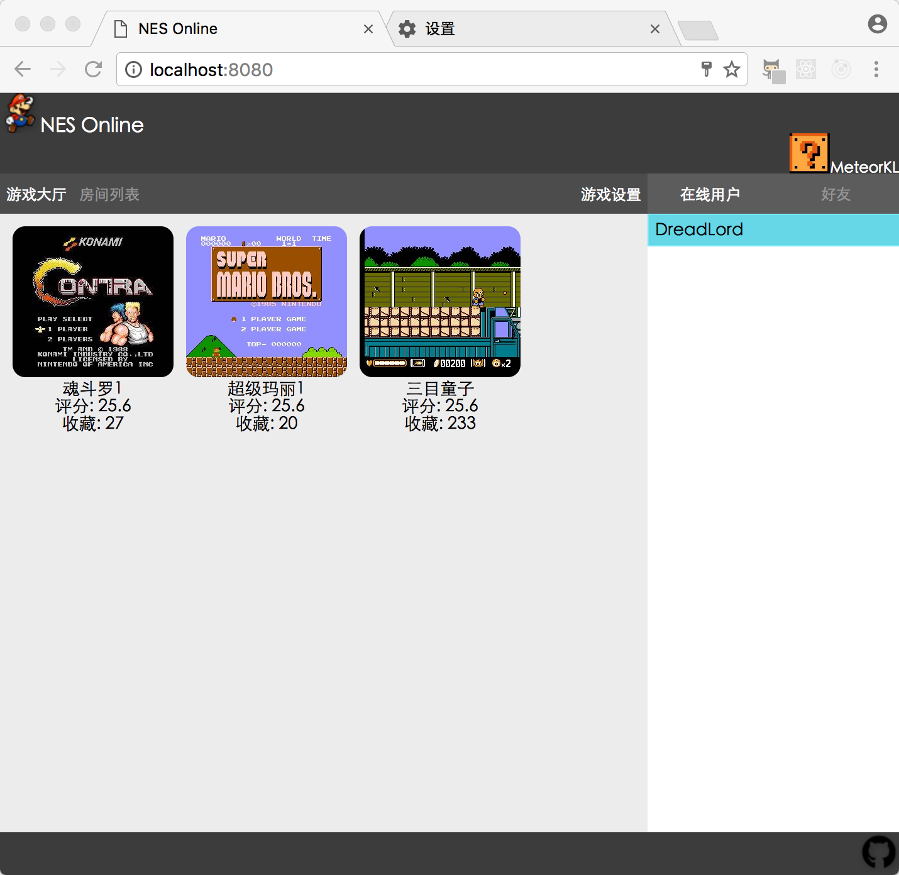

# NES Online

# logs 
* 以前的logs位于[old_logs.md](./old_logs.md)
* 现在前端用react和redux重写

## far future
* 共享操作（离开房间自动开启）
* 保存游戏，装载游戏
* 保存录像，播放录像
* 修改密码，修改头像
* 允许创建本地rom并上传
* 添加好友，显示好友状态，邀请好友
* 资源的分步加载

## before release
* 忘记密码功能
* 将窗口组件抽象话，最好能达到像滚动条一样的复用
* 同步问题

## v0.3.7
* 支持在游戏中修改按键

## v0.3.6
* 按键消息用 webRTC dataChannel传

## v0.3.5
* keycode改为对应动作（如up，down），如果不是合法按键则不发送

## v0.3.4
* 多人游戏时玩家按键消息发到服务器后不发给自己，自己的按键本地处理
* 单人游戏时玩家按键消息不经过服务器
* 如果检测到gamepad则自动支持
* 交换AB XY的默认按键设置

## v0.3.3
* 网上查了下发现我的杂牌手柄和一般的不太一样，我的上下左右是axes[9]，而一般的是buttons[12]~buttons[15]
* 修复了结束游戏后房间状态不会改变的bug
* 今天又出现了不同步...
* 经过测试发现两个玩家收到的按键消息完全一样，所以不同步的原因是同步按键这个想法不对

## v0.3.2
* 尝试加入gamepad，其他按键测试正常，但是连发键没有效果

## v0.3.1
* 今天测了几遍都是完全同步的，看来昨天的不同步可能只是少数情况？？
* 修复了游戏开始后其他玩家还能加入游戏的bug

## v0.3.0
* 游戏设置的功能实现
* 登录界面背景图片修改
* 现在基本可以玩啦
* 发现某些时候还是不同步，尴尬...
* 增加了nes的相关资料，来自https://github.com/rockcarry/ffnes
* 应该发送cpu寄存器的值而不是按键消息

## v0.2.3
* 修复单人模式不能开始游戏
* 增加连发按键
* 画了一下游戏设置的界面

## v0.2.2
* keyboardAction 改为优先队列
* 联机测试初步成功

## v0.2.1
* 把原来所有指令全部存下来导致数组不断增大的懒惰办法改成只存预定的延迟帧数

## v0.2.0
* 本地完全同步666

## v0.1.2
* 界面做的差不多了，单人模式可以玩了，按键设置可以同步到服务器了

## v0.1.0
* 第一个可以重用的组件 滚动条

## v0.0.1
* 打算做成单页面应用，后端做成api的形式，
* 初步学习了react和redux的用法，感官不错，减少了复制粘贴的部分，
而且界面分割，事件绑定，状态管理等都比裸奔好了无数倍，
但是...我写的代码依旧很糟糕...

# reference
* JSNES: https://github.com/bfirsh/jsnes
* react: https://facebook.github.io/react/docs/installation.html
* redux: http://cn.redux.js.org/index.html
* webRTC: http://blog.csdn.net/inszva/article/details/52840393
* localStorage & Gamepad: https://github.com/josephlewis42/jsnes
* Gamepad: https://developer.mozilla.org/en-US/docs/Web/API/Gamepad_API
* UI: Nostalgia.NES
* nes相关资料: https://github.com/rockcarry/ffnes
* nes硬件知识: http://problemkaputt.de/everynes.htm

# contact me
* mail: nes@juanix.cn