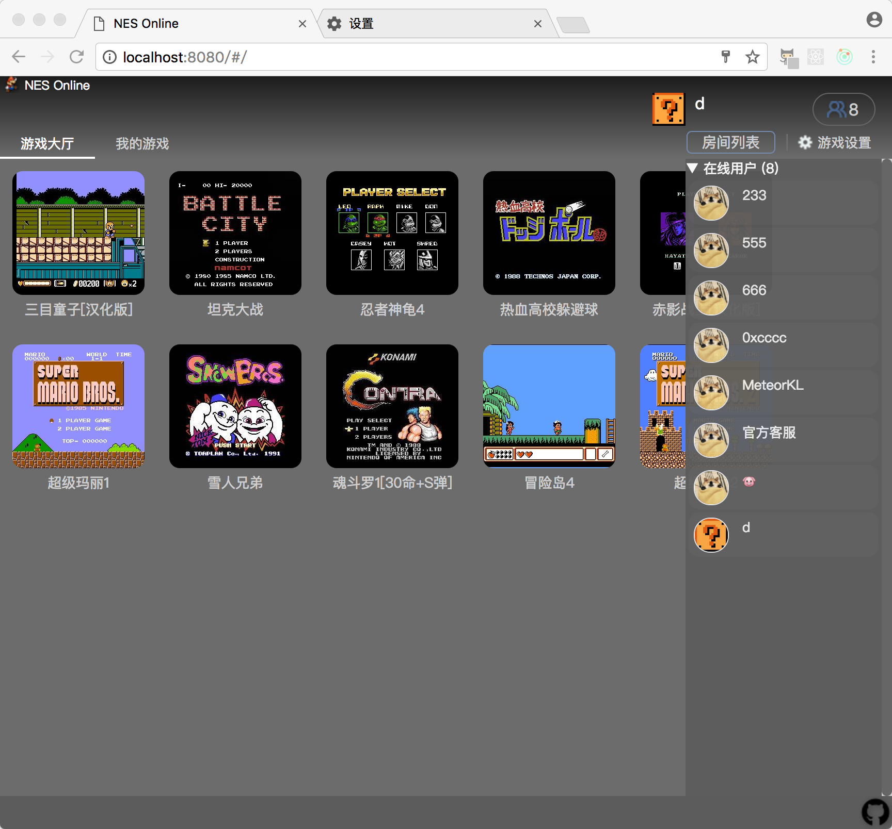

# NES Online

## 已知bug
* 房间状态

## TODO
* 本地模式支持两个玩家的按键
* 保存游戏，装载游戏
* 保存录像，播放录像
* 允许创建本地rom并上传
* 共享操作（离开房间自动开启）
* 修改头像
* 好友列表，添加好友，显示好友状态，邀请好友
* 资源的分步加载

# reference
* JSNES: https://github.com/bfirsh/jsnes
* react: https://facebook.github.io/react/docs/installation.html
* redux: http://cn.redux.js.org/index.html
* webRTC: http://blog.csdn.net/inszva/article/details/52840393
* localStorage & Gamepad: https://github.com/josephlewis42/jsnes
* Gamepad: https://developer.mozilla.org/en-US/docs/Web/API/Gamepad_API
* UI: Nostalgia.NES
* nes相关资料: https://github.com/rockcarry/ffnes
* nes硬件知识: http://problemkaputt.de/everynes.htm

# contact me
* mail: imeteorkl@gmail.com